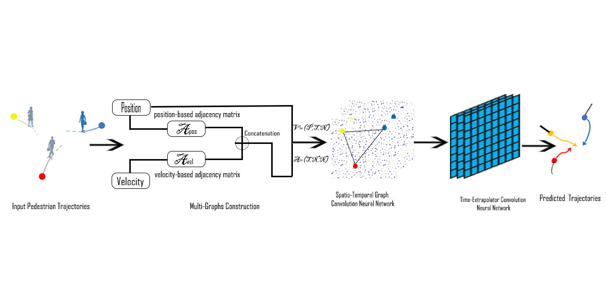

# STMGCN: ASpatio-Temporal Multi-Graph Convolutional Neural Network for Human Trajectory Prediction
### Taki Youssef

### STM-GCN
<div align='center'>
</img>
</div>
<br />
we propose a Spatio-Temporal Multi-Graphs Convolutional Network (STMGCN), which collects information about the social interactions of pedestrians in a crowd by focusing on extracting the largest number of relationships and creating multiple graphs,  Our results show an improvement over the state of art by 10\% on the Final Displacement Error (FDE) and  6\%  on the Average Displacement Error (ADE).


#### Model
<br />
Social-STGCNN model consists of 2 building blocks: <br />
1- ST-GCNN: A Spatio-Tempral Graph CNN that creates a spatio-temporal graph embedding representing the previous pedestrians trajectories. <br />
2- TXP-CNN: A Time-Extrapolator CNN that utilizes the spatio-temporal graph embedding to predict future trajectories.<br />


### Setup: 
The code was written using python 3.6. 
The following libraries are the minimal to run the code: 
```python
import pytorch
import networkx
import numpy
import tqdm
```
or you can have everything set up by running: 
```bash
pip install -r requirements.txt
```
### Using the code:
To use the pretrained models at `checkpoint/` and evaluate the models performance run:
```bash
test.py
```

To train a model for each data set with the best configuration as in the paper, simply run:
```bash
./train.sh  
```
Please note: The initiation of training and testing might take a while as the code creates a cache to store the spatio-temporal graphs.
<br />
Exact CVPR version: https://github.com/abduallahmohamed/Social-STGCNN/tree/ebd57aaf34d84763825d05cf9d4eff738d8c96bb

Check our work in the 3D mode: https://github.com/abduallahmohamed/Skeleton-Graph
